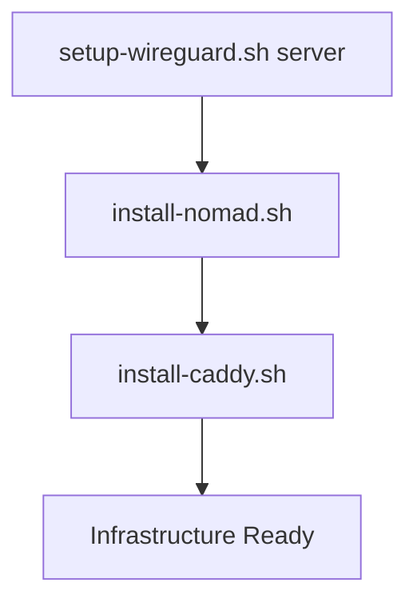

# 🔧 Scripts DevOps

Scripts d'installation et déploiement pour infrastructure Nomad + WireGuard.

---

## 📦 Installation Infrastructure (Serveur)

### **Script Principal : `setup-server.sh`** ✅ RECOMMANDÉ

Installation complète dans le bon ordre :
1. WireGuard VPN
2. Nomad Server + Client  
3. Caddy Reverse Proxy

```bash
# Sur serveur 31.57.224.79
ssh root@31.57.224.79
cd /root/agent_economique_stable/devops/scripts

# Installation complète
chmod +x setup-server.sh
./setup-server.sh
```

**Durée:** ~15-20 minutes  
**Pré-requis:** Ubuntu 24.04 LTS, root access

---

## 🔧 Scripts Individuels

### **1. `setup-wireguard.sh`**

Configure WireGuard VPN (serveur ou client).

**IMPORTANT:** À exécuter EN PREMIER (avant Nomad).

```bash
# Serveur
chmod +x setup-wireguard.sh
./setup-wireguard.sh server

# Client (sur machine locale)
./setup-wireguard.sh client
```

**Notes:**
- Génère les clés automatiquement
- Configure interface `wg0`
- Nomad utilisera cette interface réseau

---

### **2. `install-nomad.sh`**

Installe Nomad Server + Client.

**IMPORTANT:** WireGuard doit être installé AVANT.

```bash
chmod +x install-nomad.sh
./install-nomad.sh
```

**Configuration:**
- Datacenter: `sg1`
- Network interface: `wg0` (WireGuard)
- Host volume: `/root/data` (générique)
- UI: Port 4646

---

### **3. `install-caddy.sh`**

Installe Caddy reverse proxy.

```bash
chmod +x install-caddy.sh
./install-caddy.sh
```

**Endpoints:**
- `http://10.8.0.1:80` → Nomad UI
- `http://10.8.0.1:8080/health` → Health check

---

## 🚀 Déploiement Application

### **Scripts de déploiement** (À créer)

```bash
# Deploy binary
./deploy-binary.sh

# Deploy Nomad job
./deploy-nomad-job.sh

# Full deployment
./full-deploy.sh
```

---

## 📊 Ordre d'Exécution

### **Setup Infrastructure (One-Time)**



**OU utiliser script master:**

```bash
./setup-server.sh  # Fait tout automatiquement
```

---

### **Déploiement Application (Répété)**

```
1. Compile binary (local)
2. Upload binary (deploy-binary.sh)
3. Deploy Nomad job (deploy-nomad-job.sh)
```

---

## ⚠️ Points Importants

### **WireGuard AVANT Nomad**

Nomad client utilise l'interface réseau `wg0` pour les communications.  
**Si WireGuard n'est pas installé en premier, Nomad utilisera l'interface par défaut.**

### **Path Générique `/root/data`**

Le volume Nomad pointe vers `/root/data` (pas spécifique à une app).  
Cela permet de déployer plusieurs applications :

```
/root/data/
├── scalping-live-bybit/
│   ├── scalping_live_bybit
│   ├── config/
│   ├── logs/
│   └── state/
├── autre-app/
│   └── ...
└── ...
```

### **Network Interface `wg0`**

Jobs Nomad utilisent l'interface WireGuard pour :
- Isolation réseau
- Sécurité VPN
- Traffic chiffré

---

## ✅ Vérifications Post-Installation

```bash
# 1. WireGuard actif
wg show
# Expected: interface wg0, peer connected

# 2. Nomad opérationnel
systemctl status nomad
nomad server members
nomad node status

# 3. Caddy actif
systemctl status caddy
curl http://10.8.0.1:8080/health

# 4. Firewall configuré
ufw status
```

---

## 🆘 Troubleshooting

### **Nomad n'utilise pas wg0**

```bash
# Vérifier config Nomad
grep network_interface /etc/nomad.d/nomad.hcl

# Should show: network_interface = "wg0"
```

**Solution:** Réinstaller Nomad APRÈS WireGuard.

### **Volume app-data non accessible**

```bash
# Vérifier volume Nomad
grep -A 3 "host_volume" /etc/nomad.d/nomad.hcl

# Should show: path = "/root/data"
```

### **Caddy ne démarre pas**

```bash
# Vérifier config
caddy validate --config /etc/caddy/Caddyfile

# Voir logs
journalctl -u caddy -n 50
```

---

## 📚 Documentation Complète

Voir `devops/docs/` pour guides détaillés :
- `01-nomad-server-setup.md`
- `02-wireguard-vpn.md`
- `03-deployment-workflow.md`

---

## 🔐 Sécurité

- ✅ Firewall UFW activé
- ✅ Services accessibles uniquement via VPN
- ✅ Clés WireGuard privées (chmod 600)
- ⚠️ ACL Nomad désactivé (à activer en prod)

---

**Version:** 1.0.0  
**Last Updated:** 2025-11-06  
**Serveur:** 31.57.224.79 (Singapore)
