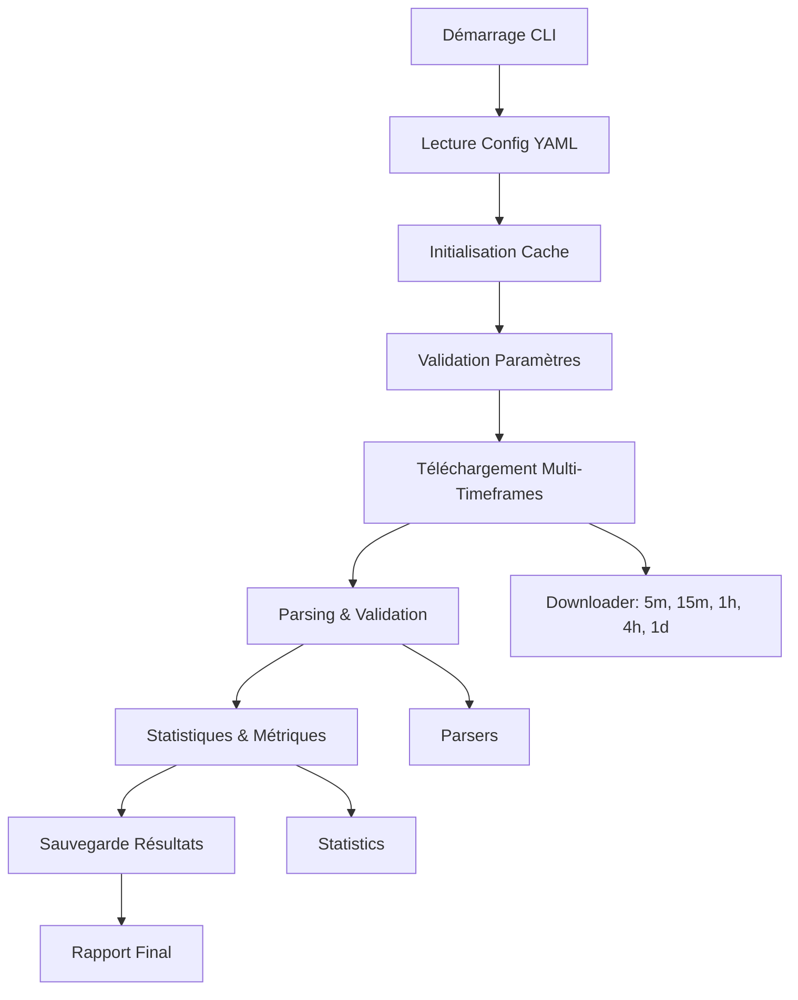

# Documentation Workflow - Application CLI Agent Économique

**Version :** 1.0.0  
**Date :** 2025-10-31  
**Objectif :** Application en ligne de commande pour téléchargement multi-timeframes et analyse de données Binance

## Vue d'ensemble du Workflow

L'application CLI `agent-economique` permet de télécharger, traiter et analyser automatiquement les données de marché Binance multi-timeframes selon une configuration définie.

## Architecture du Workflow



## Étapes Détaillées

### 1. **Initialisation (Phase Bootstrap)**
- Lecture du fichier de configuration YAML
- Validation des paramètres requis
- Initialisation du cache local
- Setup logging et métriques

### 2. **Phase Téléchargement**
- Vérification existence locale (cache)
- Téléchargement parallèle des fichiers manquants
- Validation checksums
- Retry automatique en cas d'échec

### 3. **Phase Traitement**
- Parsing des fichiers ZIP téléchargés
- Validation des données (continuité, cohérence)
- Streaming pour optimisation mémoire
- Détection anomalies

### 4. **Phase Analytics**
- Calcul statistiques de marché par timeframe
- Métriques de performance
- Analyse qualité des données
- Génération insights

### 5. **Phase Sauvegarde**
- Export données par timeframe
- Sauvegarde métriques et statistiques
- Backup configuration
- Nettoyage fichiers temporaires

## Modes d'Exécution

### Mode Standard
```bash
agent-economique --config config.yaml
```

### Mode Téléchargement Seulement
```bash
agent-economique --config config.yaml --download-only
```

### Mode Batch (Multiple Symboles)
```bash
agent-economique --config config.yaml --batch --symbols SOLUSDT,ETHUSDT,BTCUSDT
```

### Mode Streaming
```bash
agent-economique --config config.yaml --stream --memory-limit 100MB
```

## Structure Configuration

```yaml
# Configuration Application CLI
app:
  name: "agent-economique"
  version: "1.0.0"
  log_level: "info"

# Configuration Données
data:
  symbols: ["SOLUSDT", "ETHUSDT", "BTCUSDT"]
  timeframes: ["5m", "15m", "1h", "4h"]
  date_range:
    start: "2023-06-01"
    end: "2023-06-30"
  types: ["klines", "trades"]

# Configuration Téléchargement
download:
  base_url: "https://data.binance.vision"
  max_concurrent: 5
  max_retries: 3
  timeout: "10m"
  verify_checksums: true

# Configuration Cache
cache:
  root_path: "./data/cache"
  max_size_gb: 10
  cleanup_old: true
  retention_days: 30

# Configuration Performance
performance:
  max_memory_mb: 512
  buffer_size: 8192
  enable_metrics: true
  parallel_processing: true
```

## Gestion d'Erreurs

### Erreurs Récupérables
- Échec téléchargement → Retry automatique
- Corruption fichier → Re-téléchargement
- Timeout réseau → Backoff exponentiel

### Erreurs Critiques
- Configuration invalide → Arrêt immédiat
- Espace disque insuffisant → Nettoyage + arrêt
- Erreur validation → Rollback + rapport

## Métriques & Monitoring

### Métriques Collectées
- Vitesse téléchargement (MB/s)
- Taux d'erreur par opération
- Utilisation mémoire/CPU
- Temps traitement par symbole
- Taille données traitées

### Outputs
- Logs structurés (JSON)
- Métriques Prometheus
- Rapport de santé
- Dashboard temps réel

## Points de Contrôle

### Checkpoints Automatiques
- Après chaque symbole téléchargé
- Après traitement de chaque timeframe
- En cas d'interruption gracieuse

### Reprise sur Erreur
- Détection état précédent
- Reprise au dernier checkpoint
- Validation intégrité données

## Optimisations Performance

### Téléchargement
- Connexions parallèles
- Compression gzip
- Cache intelligent
- Vérification différentielle

### Traitement
- Streaming mémoire
- Pool de workers
- Batch processing
- Garbage collection optimisé

## Sécurité

### Validation Données
- Checksums SHA256
- Validation signatures
- Détection tampering
- Quarantaine fichiers suspects

### Filesystem
- Permissions restreintes
- Sandbox téléchargements
- Validation chemins
- Nettoyage sécurisé

---

**Note :** Ce workflow garantit robustesse, performance et fiabilité pour le traitement automatisé de grandes volumes de données de marché.
