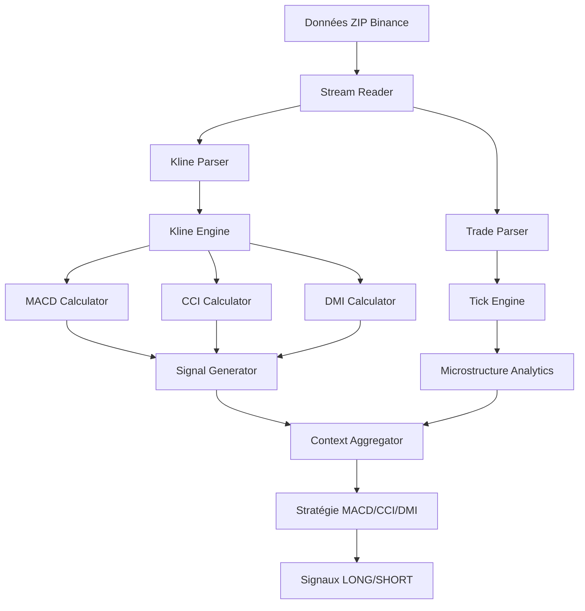

# User Story 4: Intégration avec la stratégie MACD/CCI/DMI

**Epic:** Gestionnaire de données historiques Binance  
**Priorité:** Haute  
**Estimation:** 13 points  
**Sprint:** 2-3

## Description

> **En tant qu'** algorithme de trading  
> **Je veux** recevoir les données formatées pour mes calculs d'indicateurs  
> **Afin de** générer les signaux LONG/SHORT selon ma stratégie

## Contexte métier

L'agent économique implémente une stratégie basée sur 3 indicateurs techniques :
- **MACD (12,26,9)** : signal principal de croisement
- **CCI (14)** : zones extrêmes de survente/surachat  
- **DMI (14)** : analyse tendance/contre-tendance

Les données streamées doivent alimenter ces calculs en temps réel pour générer les signaux d'entrée/sortie selon les règles définies.

## Critères d'acceptation

### ✅ Klines formatées pour calcul indicateurs
- **ÉTANT DONNÉ** des données OHLCV streamées depuis Binance
- **QUAND** le Kline Engine reçoit ces données
- **ALORS** les structures doivent permettre le calcul MACD/CCI/DMI

### ✅ Trades formatées pour microstructure
- **ÉTANT DONNÉ** des trades individuels streamés
- **QUAND** le Tick Engine les traite
- **ALORS** les analytics de microstructure doivent être calculées

### ✅ Synchronisation multi-timeframes
- **ÉTANT DONNÉ** des données sur 4 timeframes (5m, 15m, 1h, 4h)
- **QUAND** les indicateurs sont calculés
- **ALORS** il ne doit pas y avoir de décalage temporel entre timeframes

### ✅ Interface cohérente avec Context
- **ÉTANT DONNÉ** les indicateurs calculés
- **QUAND** le contexte unifié est généré
- **ALORS** il doit respecter l'interface `Context` de l'agent

## Définition of Done

- [ ] Intégration Kline Engine avec calculs MACD/CCI/DMI
- [ ] Intégration Tick Engine avec microstructure
- [ ] Synchronisation multi-timeframes validée
- [ ] Génération signaux selon règles stratégie
- [ ] Tests end-to-end avec données réelles
- [ ] Performance conforme (< 500ms latence)

## Cas de test principaux

### Test 1: Calcul indicateurs MACD
```go
func TestMACDCalculation() {
    klines := loadTestKlines("SOLUSDT", "1h")
    engine := NewKlineEngine()
    
    for _, kline := range klines {
        engine.ProcessKline(kline)
    }
    
    macd := engine.GetMACD("SOLUSDT", "1h")
    assert.NotNil(t, macd)
    assert.Greater(t, len(macd.Values), 26) // Période minimale
}
```

### Test 2: Signaux LONG selon stratégie
```go
func TestLongSignalGeneration() {
    // Conditions: MACD croise hausse + CCI survente + DI+ > DI-
    engine := setupEngineWithTestData()
    
    signals := engine.GenerateSignals("SOLUSDT", "1h")
    longSignals := filterSignalsByType(signals, "LONG_ENTRY")
    
    for _, signal := range longSignals {
        assert.True(t, signal.MACDCrossedUp)
        assert.Less(t, signal.CCI, -100.0) // Survente
        assert.Greater(t, signal.DIPlus, signal.DIMinus)
    }
}
```

### Test 3: Synchronisation multi-TF
```go
func TestMultiTimeframeSync() {
    data := loadSynchronizedData("SOLUSDT")
    engine := NewKlineEngine()
    
    // Alimenter tous les timeframes
    for tf := range []string{"5m", "15m", "1h", "4h"} {
        engine.ProcessTimeframe(tf, data[tf])
    }
    
    context := engine.GetSynchronizedContext(testTimestamp)
    
    // Vérifier cohérence temporelle
    assert.Equal(t, context.Indicators["5m"].Timestamp, testTimestamp)
    assert.Equal(t, context.Indicators["1h"].Timestamp, testTimestamp)
}
```

## Spécifications techniques

### Structure indicateurs
```go
type IndicatorSnapshot struct {
    Symbol    string
    Timeframe string
    Timestamp int64
    MACD      *MACDValues
    CCI       *CCIValues  
    DMI       *DMIValues
}

type MACDValues struct {
    MACD      float64
    Signal    float64
    Histogram float64
    CrossUp   bool
    CrossDown bool
}

type CCIValues struct {
    Value     float64
    IsOversold bool
    IsOverbought bool
    Zone      CCIZone // NORMAL, EXTREME, REVERSAL
}

type DMIValues struct {
    DIPlus    float64
    DIMinus   float64
    DX        float64
    ADX       float64
    TrendDir  TrendDirection
}
```

### Règles stratégie implémentées
```go
type StrategyRules struct {
    // Signaux LONG
    LongMACDCross    bool    // MACD croise à la hausse
    LongCCIOversold  float64 // CCI < -100 (tendance) ou < -150 (contre-tendance)
    LongDMITrend     bool    // DI+ > DI- (tendance) ou DI- > DI+ (contre-tendance)
    
    // Signaux SHORT  
    ShortMACDCross   bool    // MACD croise à la baisse
    ShortCCIOverbought float64 // CCI > 120 (tendance) ou > 180 (contre-tendance)
    ShortDMITrend    bool    // DI+ < DI- (tendance) ou DI+ > DI- (contre-tendance)
    
    // Filtres optionnels
    MACDSameSignFilter bool   // MACD et signal même signe
    DXADXFilter       bool   // Filtre DX/ADX
}
```

### Configuration stratégie
```yaml
strategy:
  indicators:
    macd:
      fast_period: 12
      slow_period: 26  
      signal_period: 9
    cci:
      period: 14
      long_trend_oversold: -100
      long_counter_trend_oversold: -150
      short_trend_overbought: 120
      short_counter_trend_overbought: 180
    dmi:
      period: 14
      adx_period: 14
  
  filters:
    macd_same_sign_filter: false
    dmi_trend_signals_enabled: true
    dmi_counter_trend_signals_enabled: false
    dx_adx_filter_enabled: false
```

## Intégration avec Context

### Context étendu pour stratégie
```go
type Context struct {
    // Données de base (existant)
    Timestamp    int64
    Symbol       string
    Environment  string
    
    // Indicateurs par timeframe
    Indicators   map[string]*IndicatorSnapshot
    
    // Analytics microstructure
    TickAnalytics *TickAnalytics
    
    // Signaux générés
    Signals      []StrategySignal
    
    // Méta-données stratégie
    StrategyState *StrategyState
}

type StrategySignal struct {
    Type        SignalType // LONG_ENTRY, SHORT_ENTRY, EXIT
    Timestamp   int64
    Symbol      string
    Timeframe   string
    Confidence  float64
    TriggerIndicators map[string]interface{}
    Context     *MarketContext
}
```

## Dépendances

- Dépend de: User Story 3 (Lecteur streaming)
- Dépend de: Kline Engine (à implémenter)
- Dépend de: Tick Engine (à implémenter)
- Bloque: User Story 5 (Monitoring)

## Flux de données complet



## Métriques de performance

- **Latence calcul:** < 100ms par indicateur
- **Latence signaux:** < 500ms end-to-end
- **Mémoire indicateurs:** < 200MB pour 4 timeframes
- **Précision calculs:** Erreur < 0.001% vs références

## Critères de validation

- Indicateurs calculés correctement vs références (TradingView)
- Signaux générés selon règles strictes de la stratégie
- Performance temps réel maintenue sur gros volumes
- Pas de faux signaux dus à décalages temporels
- Intégration transparente avec Money Management
