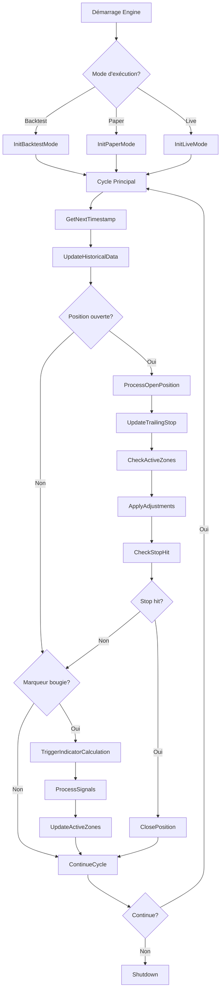
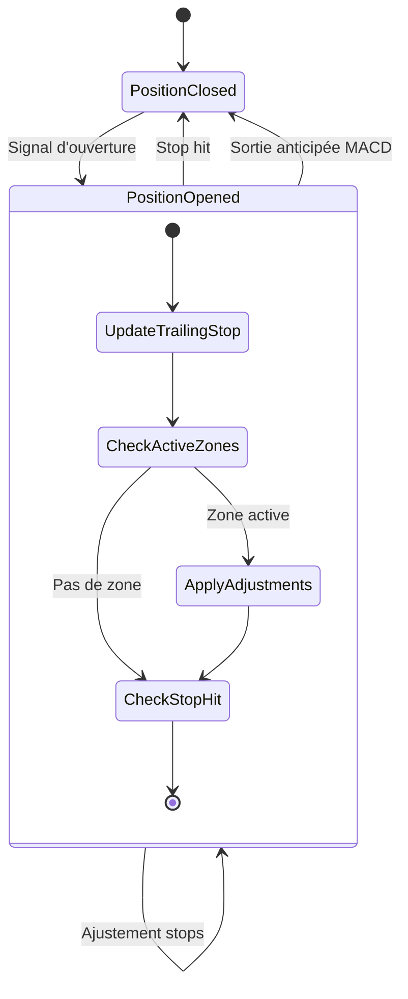

# Workflow 4: Engine Temporel - Cycles et Orchestration

**Version:** 1.0  
**Statut:** Workflow technique détaillé  
**Module:** Engine Temporel - Gestion cycles temporels  

## Vue d'ensemble

Ce workflow décrit l'orchestration complète de l'Engine Temporel dans tous ses modes d'exécution, avec focus sur la gestion du `Current_Timestamp`, les cycles adaptatifs et la coordination des positions/zones.

## Workflow principal unifié

### Diagramme général


## Workflow 1: Initialisation par mode

### Backtest Mode
```yaml
InitBacktestMode:
  Inputs:
    - start_date: "2023-06-01"
    - end_date: "2023-06-30" 
    - symbols: ["SOLUSDT", "SUIUSDT"]
    - timeframes: ["5m", "15m", "1h", "4h"]
  
  Steps:
    1. LoadHistoricalData:
        - Charger trades chronologiques par symbole
        - Valider continuité temporelle
        - Créer index marqueurs bougies (00:00:00)
        
    2. InitializeComponents:
        - PositionManager: état position vide
        - ZoneMonitor: zones inactives  
        - TradeIterator: première position
        
    3. SetInitialTimestamp:
        - Current_Timestamp = première trade.timestamp
        - Validation anti-look-ahead activée
        - Historiques initialisés vides
  
  Outputs:
    - Engine prêt pour cycle trade-par-trade
    - Performance: < 100ms initialisation
```

### Paper/Live Mode  
```yaml
InitPaperLiveMode:
  Inputs:
    - symbols: configuration active
    - timeframes: configuration active
    - loop_interval: 10 secondes
    
  Steps:
    1. ConnectDataSources:
        - API Binance ou source paper
        - Validation connexion temps réel
        - Buffer données en streaming
        
    2. InitializeComponents:
        - PositionManager: état vide
        - ZoneMonitor: zones inactives
        - LastCandleTracker: dernières bougies connues
        
    3. SetRealTimeTimestamp:
        - Current_Timestamp = NOW (temps système)
        - Synchronisation horloge système
        - Historiques chargés dernière session
        
  Outputs:
    - Engine prêt pour loops 10 secondes
    - Connexion temps réel établie
```

## Workflow 2: Gestion Current_Timestamp

### Algorithme central
```go
// Pseudo-code Go structure
func (e *TemporalEngine) GetNextTimestamp() (int64, error) {
    switch e.executionMode {
    case BacktestMode:
        // Avancer au prochain trade chronologique
        if e.tradeIterator.HasNext() {
            trade := e.tradeIterator.Next()
            return trade.Timestamp, nil
        }
        return 0, ErrBacktestComplete
        
    case PaperMode, LiveMode:
        // Timestamp temps réel
        return time.Now().UnixMilli(), nil
    }
}

func (e *TemporalEngine) UpdateHistoricalData(newTimestamp int64) error {
    // Ajouter nouvelles données ≤ newTimestamp
    newData := e.dataSource.GetDataUntil(newTimestamp)
    
    // Validation anti-look-ahead
    for _, item := range newData {
        if item.Timestamp > newTimestamp {
            return ErrLookAheadDetected
        }
    }
    
    // Mise à jour historiques
    e.historicalCandles.Append(newData.Candles)
    e.historicalTrades.Append(newData.Trades)
    
    e.currentTimestamp = newTimestamp
    return nil
}
```

### Validation temporelle
```yaml
AntiLookAheadValidation:
  Triggers:
    - À chaque accès données historiques
    - Avant chaque calcul indicateurs
    - Lors mise à jour Current_Timestamp
    
  Rules:
    - AUCUNE donnée timestamp > Current_Timestamp accessible
    - Exception levée si tentative accès futur
    - Logs détaillés violations temporelles
    
  Implementation:
    - Wrapper sur tous accès données
    - Validation automatique en debug mode
    - Métriques violations en production
```

## Workflow 3: Détection marqueurs bougies

### Algorithme détection
```go
func (e *TemporalEngine) IsMarkerTimestamp(timestamp int64) bool {
    // Convertir timestamp en time.Time UTC
    t := time.Unix(timestamp/1000, (timestamp%1000)*1000000).UTC()
    
    // Vérifier si début de minute (00 secondes)
    if t.Second() != 0 {
        return false
    }
    
    // Vérifier alignement avec timeframes actifs
    minute := t.Minute()
    
    for _, tf := range e.config.Timeframes {
        switch tf {
        case "5m":
            if minute % 5 == 0 { return true }
        case "15m":
            if minute % 15 == 0 { return true }
        case "1h":
            if minute == 0 { return true }
        case "4h":
            if minute == 0 && t.Hour() % 4 == 0 { return true }
        }
    }
    
    return false
}
```

### Synchronisation multi-timeframes
```yaml
MultiTimeframeSync:
  Scenario: "Marqueur 10:00:00"
  
  Detection:
    - 5m: 10:00:00 % 5min = 0 ✓ (nouvelle bougie)
    - 15m: 10:00:00 % 15min = 0 ✓ (nouvelle bougie)  
    - 1h: 10:00:00 % 60min = 0 ✓ (nouvelle bougie)
    - 4h: 10:00:00 % 240min = 0 ✓ (si 10h = multiple 4)
    
  Actions:
    1. Déclencher calculs pour chaque TF concerné
    2. Utiliser même Current_Timestamp pour tous
    3. Synchroniser résultats avant signaux
    4. Résolution conflits signaux inter-TF
    
  Performance:
    - Calculs parallèles par TF (goroutines)
    - Timeout global 200ms
    - Fallback si TF individuel échoue
```

## Workflow 4: Gestion position ouverte

### États et transitions


### Algorithme gestion position
```yaml
ProcessOpenPosition:
  Inputs:
    - position: Position courante
    - current_price: Prix actuel du trade
    - active_zones: Zones surveillées
    
  Steps:
    1. UpdateTrailingStop:
        algorithm: |
          profit_percent = (current_price - entry_price) / entry_price * 100
          if position.Direction == LONG:
              base_stop = current_price * (1 - trailing_stop_percent/100)
          else:
              base_stop = current_price * (1 + trailing_stop_percent/100)
          
          # Application seulement si plus serré
          if IsStopTighter(base_stop, position.StopLoss):
              position.StopLoss = base_stop
              
    2. CheckActiveZones:
        for zone in active_zones:
            if zone.Active:
                CheckZoneConditions(zone, profit_percent)
                
    3. ApplyAdjustments:
        if adjustment_triggered:
            new_stop = CalculateAdjustmentFromGrid(profit_percent)
            if IsStopTighter(new_stop, position.StopLoss):
                position.StopLoss = new_stop
                LogAdjustment("Zone adjustment applied")
                
    4. CheckStopHit:
        if position.Direction == LONG && current_price <= position.StopLoss:
            return CLOSE_POSITION
        elif position.Direction == SHORT && current_price >= position.StopLoss:
            return CLOSE_POSITION
            
  Outputs:
    - position: Position mise à jour
    - action: CONTINUE | CLOSE_POSITION
```

## Workflow 5: Zones actives monitoring

### Algorithme surveillance
```yaml
ZoneMonitoring:
  ActiveZones:
    CCI_INVERSE:
      conditions: |
        - CCI dans zone opposée à position
        - Vérification à chaque trade
        - Désactivation si CCI sort de zone
        
    MACD_INVERSE:
      conditions: |
        - Croisement MACD inverse détecté
        - Profit > seuil configuré
        - Événement unique (pas monitoring continu)
        
    DI_COUNTER:
      conditions: |
        - DI croise contre tendance position
        - Profit > seuil configuré  
        - Événement unique (pas monitoring continu)
  
  MonitoringLogic:
    frequency: "per_trade" # À chaque nouveau trade
    
    algorithm: |
      for zone_type, zone in active_zones:
          if not zone.Active:
              continue
              
          current_profit = CalculateProfitPercent()
          
          switch zone_type:
          case CCI_INVERSE:
              # Monitoring continu tant qu'en zone
              if not IsInCCIZone(current_cci, zone.TriggerZone):
                  DeactivateZone(CCI_INVERSE)
                  continue
              
              # Vérifier conditions grille
              if ShouldApplyGrid(current_profit, zone.LastAdjustment):
                  TriggerAdjustment(current_profit)
                  
          case MACD_INVERSE, DI_COUNTER:
              # Événements uniques, vérifier conditions une fois
              if ShouldApplyGrid(current_profit, zone.TriggerTime):
                  TriggerAdjustment(current_profit)
                  DeactivateZone(zone_type) # Une seule application
```

## Workflow 6: Performance et métriques

### Métriques temps réel
```yaml
PerformanceMonitoring:
  Metrics:
    temporal:
      - current_timestamp_drift: "Écart timestamp vs temps réel"
      - cycle_latency_ms: "Latence cycle complet"
      - lookahead_violations: "Nombre violations temporelles"
      
    position:
      - position_open_duration: "Temps positions ouvertes"  
      - stop_adjustments_count: "Ajustements stops appliqués"
      - zone_activations_count: "Activations zones par type"
      
    system:
      - memory_usage_mb: "Mémoire historiques"
      - goroutines_count: "Goroutines actives"
      - cache_hit_ratio: "Ratio hits cache"
      
  Alerting:
    - cycle_latency > 200ms: "Performance dégradée"
    - memory_usage > 500MB: "Consommation mémoire excessive"
    - lookahead_violations > 0: "Intégrité temporelle compromise"
    
  Optimization:
    - Parallel processing multi-symboles
    - Cache intelligent données récentes
    - Garbage collection optimisé historiques
```

## Workflow 7: Gestion erreurs et recovery

### Stratégies de récupération
```yaml
ErrorHandling:
  ErrorTypes:
    TEMPORAL_DRIFT:
      description: "Décalage timestamp significatif"
      recovery: "Resynchronisation forcée"
      
    INSUFFICIENT_DATA:
      description: "Données manquantes pour calculs"
      recovery: "Attente accumulation données"
      
    CALCULATION_TIMEOUT:
      description: "Calculs indicateurs timeout"
      recovery: "Utilisation cache/valeurs précédentes"
      
    POSITION_INCONSISTENCY:
      description: "État position incohérent"
      recovery: "Reset position + validation"
      
  RecoveryStrategies:
    graceful_degradation:
      - Signaux avec confiance réduite
      - Calculs partiels si données limitées
      - Mode sécurisé avec stops serrés
      
    automatic_retry:
      - Retry calculs avec timeout étendu
      - Re-connexion sources données
      - Rechargement configuration
      
    emergency_shutdown:
      - Fermeture positions ouvertes
      - Sauvegarde état complet
      - Notification alertes critiques
```

## Configuration référence

```yaml
engine_temporal:
  # Temporel
  window_size: 300
  anti_lookahead: true
  timestamp_precision: "milliseconds"
  
  # Cycles
  backtest:
    cycle_type: "trades"
    marker_detection: "precise" # 00:00:00 exact
    performance_mode: false
    
  paper_live:
    loop_interval: 10 # secondes
    candle_detection: true
    real_time_sync: true
    
  # Position
  position:
    max_positions: 1
    trailing_stop:
      trend_percent: 2.0
      counter_trend_percent: 1.5
    adjustment_grid:
      - profit_range: [0, 5]
        trailing_percent: 2.0
      - profit_range: [5, 10]
        trailing_percent: 1.5
        
  # Zones
  zones:
    cci_inverse:
      enabled: true
      monitoring: "continuous"
    macd_inverse:
      enabled: true
      profit_threshold: 0.5
    di_counter:
      enabled: true
      profit_threshold: 1.0
      
  # Performance
  performance:
    max_cycle_latency_ms: 200
    max_memory_mb: 500
    parallel_symbols: true
    cache_enabled: true
```

---

*Version 1.0 - Engine Temporel Workflows : Orchestration complète cycles temporels et gestion positions*
