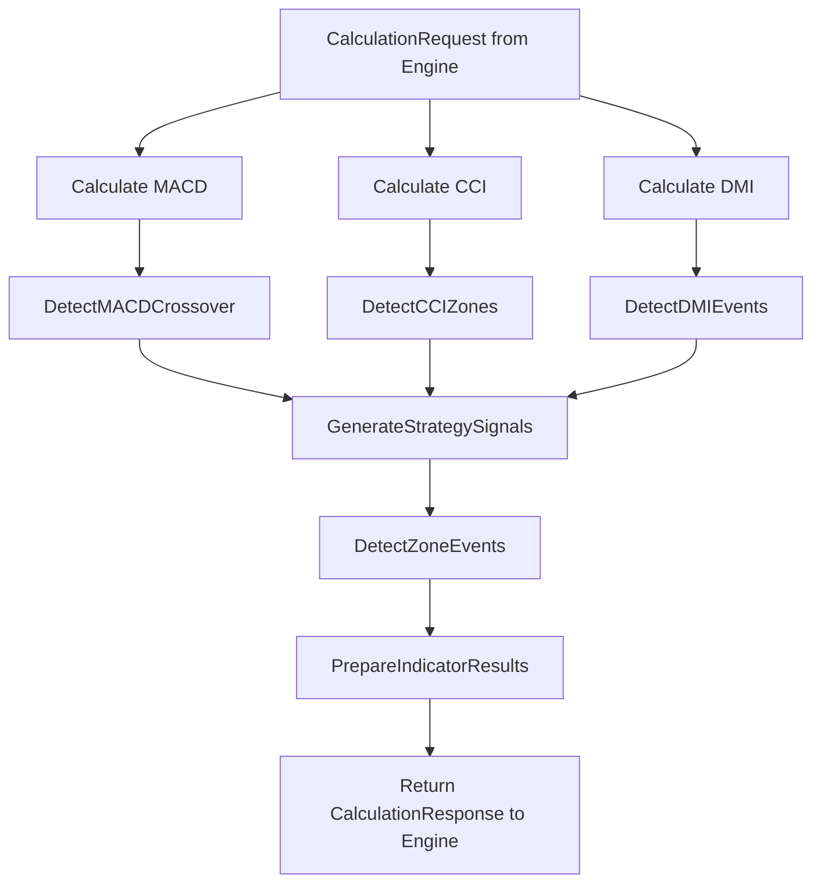

# Workflow 5: Module Indicateurs - Interface & Signal Generator

**Version:** 1.1 - **RÉVISÉ SANS REDONDANCES**  
**Statut:** Workflow module indicateurs uniquement  
**Module:** Indicateurs Techniques - Calculs purs & signaux  

## Vue d'ensemble

Ce workflow décrit **UNIQUEMENT** les responsabilités du module Indicateurs, sans redondance avec l'Engine Temporel qui gère déjà : validation données, window management, marqueurs bougies, types zones.

**Principe :** Module Indicateurs = Calculateur stateless qui reçoit données propres et retourne résultats purs.

## Workflow principal module indicateurs

### Diagramme épuré (sans redondances Engine)


**Supprimé (déjà dans Engine) :** ValidateRequest, ExtractCandleData, DataQuality, ValidateSignals

## Workflow 1: Interface de communication Engine ↔ Indicateurs

### Structures d'échange (nouvelles - pas de redondance)
```go
// NOUVEAU: Interface communication uniquement
type CalculationRequest struct {
    // Données propres fournies par Engine (déjà validées)
    Symbol         string     // Engine a déjà validé
    Timeframe      string     // Engine a déjà validé
    CurrentTime    int64      // Engine fournit timestamp valide
    CandleWindow   []Kline    // Engine fournit window propre (déjà >= 35)
    
    // Contexte position (pour zones inverses)
    PositionContext *PositionContext  // Engine fournit contexte
    
    // ID traçabilité
    RequestID      string
}

type CalculationResponse struct {
    RequestID       string
    Success        bool
    Error          error
    
    // NOUVEAU: Résultats calculs purs
    Results        *IndicatorResults
    Signals        []StrategySignal
    ZoneEvents     []ZoneEvent        // Utilise types Engine existants
    
    CalculationTime time.Duration
}
```

## Workflow 2: Calculs indicateurs purs (stateless)

### Orchestrateur calculs (nouveau)
```go
// NOUVEAU: Coordinateur calculs - pas de redondance
func Calculate(request *CalculationRequest) *CalculationResponse {
    // Engine fournit déjà données propres, pas de validation
    klines := request.CandleWindow  // Déjà >= 35, déjà validées
    
    // Calculs indicateurs purs
    macd, signal, hist := MACDFromKlines(klines, 12, 26, 9, func(k Kline) float64 { return k.Close })
    cci := CCIFromKlines(klines, "hlc3", 14)
    plusDI, minusDI, dx, adx := DMIFromKlines(klines, 14)
    
    // Assemblage résultats
    results := &IndicatorResults{
        MACD: &MACDValues{
            MACD: macd[len(macd)-1], 
            Signal: signal[len(signal)-1],
            Histogram: hist[len(hist)-1],
            CrossoverType: detectMACDCrossover(macd, signal),
        },
        CCI: &CCIValues{
            Value: cci[len(cci)-1],
            Zone: classifyCCIZone(cci[len(cci)-1], request.PositionContext),
        },
        DMI: &DMIValues{
            PlusDI: plusDI[len(plusDI)-1],
            MinusDI: minusDI[len(minusDI)-1], 
            ADX: adx[len(adx)-1],
        },
    }
    
    return &CalculationResponse{
        RequestID: request.RequestID,
        Success: true,
        Results: results,
        Signals: generateStrategySignals(results),  // NOUVEAU
        ZoneEvents: detectZoneEvents(results, request.PositionContext), // NOUVEAU
    }
}
```

## Workflow 3: Signal Generator pur (logique stratégie)

### Générateur signaux stratégie MACD/CCI/DMI (nouveau)
```go
// NOUVEAU: Signal Generator pur - pas dans Engine
func generateStrategySignals(results *IndicatorResults) []StrategySignal {
    var signals []StrategySignal
    
    // Stratégie mémoire utilisateur MACD/CCI/DMI
    macdCross := results.MACD.CrossoverType
    cciZone := results.CCI.Zone
    diPlus := results.DMI.PlusDI
    diMinus := results.DMI.MinusDI
    
    // LONG: MACD croise hausse + CCI survente + conditions DMI
    if macdCross == CrossUp && cciZone == CCIOversold {
        if diPlus > diMinus { // Tendance
            signals = append(signals, StrategySignal{
                Direction: LongSignal,
                Type: TrendSignal,
                Confidence: calculateConfidence(results),
            })
        } else if diMinus > diPlus { // Contre-tendance  
            signals = append(signals, StrategySignal{
                Direction: LongSignal,
                Type: CounterTrendSignal,
                Confidence: calculateConfidence(results),
            })
        }
    }
    
    // SHORT: MACD croise baisse + CCI surachat + conditions DMI
    if macdCross == CrossDown && cciZone == CCIOverbought {
        if diPlus < diMinus { // Tendance
            signals = append(signals, StrategySignal{
                Direction: ShortSignal, 
                Type: TrendSignal,
                Confidence: calculateConfidence(results),
            })
        } else if diPlus > diMinus { // Contre-tendance
            signals = append(signals, StrategySignal{
                Direction: ShortSignal,
                Type: CounterTrendSignal, 
                Confidence: calculateConfidence(results),
            })
        }
    }
    
    return signals
}
```

## Workflow 4: Zone Event Detector (utilise types Engine)

### Détection événements zones (nouveau - utilise ZoneEvent Engine)
```go
// NOUVEAU: Détecteur événements - utilise types Engine existants
func detectZoneEvents(results *IndicatorResults, positionCtx *PositionContext) []ZoneEvent {
    var events []ZoneEvent
    
    // Utilise types ZoneEvent déjà définis dans Engine (pas de redondance)
    if positionCtx != nil && positionCtx.IsOpen {
        cciValue := results.CCI.Value
        
        // Détection CCI zone inverse (utilise ZoneType Engine existant)
        if positionCtx.Direction == PositionLong && positionCtx.EntryCCIZone == CCIOversold {
            if cciValue > 100 { // CCI maintenant surachat (inverse)
                events = append(events, ZoneEvent{
                    Type: "ZONE_ACTIVATED",           // Engine définit déjà
                    ZoneType: ZoneCCIInverse,        // Engine définit déjà  
                    IsInverse: true,
                    Timestamp: results.Timestamp,
                })
            }
        }
        
        // Détection MACD inverse si profit
        if positionCtx.ProfitPercent > 0.5 {
            macdCross := results.MACD.CrossoverType
            if (positionCtx.Direction == PositionLong && macdCross == CrossDown) ||
               (positionCtx.Direction == PositionShort && macdCross == CrossUp) {
                events = append(events, ZoneEvent{
                    Type: "ZONE_ACTIVATED",
                    ZoneType: ZoneMACDInverse,       // Engine définit déjà
                    RequiresProfit: true,
                    ProfitThreshold: 0.5,
                    CurrentProfit: positionCtx.ProfitPercent,
                    Timestamp: results.Timestamp,
                })
            }
        }
    }
    
    return events
}
```

## Résumé responsabilités module Indicateurs

### ✅ CE QUE LE MODULE FAIT (pas de redondance)
- **Interface communication** : CalculationRequest/Response  
- **Calculs indicateurs** : MACD/CCI/DMI purs avec fonctions existantes
- **Signal Generator** : Logique stratégie MACD/CCI/DMI pure
- **Zone Event Detector** : Utilise types Engine existants

### ❌ CE QUE LE MODULE NE FAIT PAS (Engine s'en charge)
- ❌ Validation données (Engine fait déjà)
- ❌ Window management (Engine fait déjà) 
- ❌ Marqueurs bougies (Engine fait déjà)
- ❌ Types Kline/ZoneEvent/Position (Engine a déjà)
- ❌ Configuration validation (Engine fait déjà)
- ❌ Cycles temporels (Engine fait déjà)
    - config: MACDConfig {fast: 12, slow: 26, signal: 9}
    
  Steps:
    1. CalculateEMA:
        algorithm: |
          # EMA Formula: EMA[t] = (Close[t] * k) + (EMA[t-1] * (1-k))
          # où k = 2 / (period + 1)
          
          func CalculateEMA(data []float64, period int) []float64:
              k = 2.0 / (period + 1)
              ema = make([]float64, len(data))
              ema[0] = data[0]  # Premier point = première valeur
              
              for i := 1; i < len(data); i++:
                  ema[i] = (data[i] * k) + (ema[i-1] * (1 - k))
              
              return ema
              
    2. CalculateMACD:
        ema12 = CalculateEMA(closes, 12)
        ema26 = CalculateEMA(closes, 26)
        macd_line = make([]float64, len(closes))
        
        # MACD = EMA12 - EMA26 (seulement après période 26)
        for i := 25; i < len(closes); i++:
            macd_line[i] = ema12[i] - ema26[i]
            
    3. CalculateSignal:
        # Signal = EMA du MACD sur 9 périodes
        macd_values = macd_line[25:]  # Enlever les 25 premières valeurs nulles
        signal_line = CalculateEMA(macd_values, 9)
        
    4. CalculateHistogram:
        histogram = make([]float64, len(signal_line))
        for i := 0; i < len(signal_line); i++:
            histogram[i] = macd_values[i] - signal_line[i]
            
  Outputs:
    - MACDValues: {MACD: dernière_valeur, Signal: dernière_signal, Histogram: dernier_histogram}
    - CrossoverEvents: détection croisements
    
  Precision: Erreur < 0.001% vs TradingView
```

### Détection croisements MACD
```go
func DetectMACDCrossover(current, previous *MACDValues) CrossoverEvent {
    var event CrossoverEvent
    
    // Croisement à la hausse: MACD passe au-dessus Signal
    if current.MACD > current.Signal && previous.MACD <= previous.Signal {
        event.Type = CROSSOVER_UP
        event.Detected = true
        event.Strength = math.Abs(current.MACD - current.Signal)
    }
    
    // Croisement à la baisse: MACD passe en-dessous Signal  
    if current.MACD < current.Signal && previous.MACD >= previous.Signal {
        event.Type = CROSSOVER_DOWN
        event.Detected = true
        event.Strength = math.Abs(current.MACD - current.Signal)
    }
    
    return event
}
```

## Workflow 3: Calcul CCI avec zones

### Algorithme CCI(14)
```yaml
CalculateCCI:
  Inputs:
    - highs, lows, closes: []float64
    - period: 14
    - thresholds: CCIThresholds (selon type signal)
    
  Steps:
    1. CalculateTypicalPrice:
        tp = make([]float64, len(closes))
        for i := 0; i < len(closes); i++:
            tp[i] = (highs[i] + lows[i] + closes[i]) / 3.0
            
    2. CalculateSMA:
        sma_tp = make([]float64, len(tp))
        for i := period-1; i < len(tp); i++:
            sum = 0.0
            for j := i-period+1; j <= i; j++:
                sum += tp[j]
            sma_tp[i] = sum / period
            
    3. CalculateMAD:
        # Mean Absolute Deviation
        mad = make([]float64, len(tp))
        for i := period-1; i < len(tp); i++:
            sum_deviation = 0.0
            for j := i-period+1; j <= i; j++:
                sum_deviation += math.Abs(tp[j] - sma_tp[i])
            mad[i] = sum_deviation / period
            
    4. CalculateCCI:
        cci = make([]float64, len(tp))
        constant = 0.015  # Constante standard CCI
        
        for i := period-1; i < len(tp); i++:
            if mad[i] != 0:
                cci[i] = (tp[i] - sma_tp[i]) / (constant * mad[i])
            else:
                cci[i] = 0  # Éviter division par zéro
                
  Outputs:
    - CCIValues: dernière valeur CCI calculée
    - Zone identification selon thresholds
```

### Détection zones CCI
```yaml
DetectCCIZones:
  Inputs:
    - cci_value: float64 (valeur CCI courante)
    - thresholds: CCIThresholds
    - signal_type: TREND | COUNTER_TREND
    - position_direction: LONG | SHORT | NONE
    
  Logic:
    determine_zone:
      if signal_type == TREND:
          if position_direction == LONG:
              oversold = thresholds.LongTrendOversold    # -100
              overbought = thresholds.LongTrendOverbought # +100
          else: # SHORT  
              oversold = thresholds.ShortTrendOversold    # -120
              overbought = thresholds.ShortTrendOverbought # +120
              
      else: # COUNTER_TREND
          if position_direction == LONG:
              oversold = thresholds.LongCounterOversold    # -150
              overbought = thresholds.LongCounterOverbought # +150
          else: # SHORT
              oversold = thresholds.ShortCounterOversold    # -180
              overbought = thresholds.ShortCounterOverbought # +180
              
    classify_zone:
      if cci_value <= oversold:
          return CCIZone.OVERSOLD
      elif cci_value >= overbought:
          return CCIZone.OVERBOUGHT  
      else:
          return CCIZone.NORMAL
          
  ZoneEvents:
    # Génération événements pour Engine Temporel
    if previous_zone != current_zone:
        generate ZoneEvent {
            Type: CCI_ZONE_ENTERED | CCI_ZONE_EXITED
            CurrentZone: current_zone
            PreviousZone: previous_zone  
            IsInverse: check_if_inverse_to_position()
        }
```

## Workflow 4: Calcul DMI/ADX

### Algorithme DMI(14)
```yaml
CalculateDMI:
  Inputs:
    - highs, lows, closes: []float64
    - period: 14
    
  Steps:
    1. CalculateTrueRange:
        tr = make([]float64, len(closes))
        tr[0] = highs[0] - lows[0]  # Premier TR
        
        for i := 1; i < len(closes); i++:
            tr1 = highs[i] - lows[i]
            tr2 = math.Abs(highs[i] - closes[i-1])
            tr3 = math.Abs(lows[i] - closes[i-1])
            tr[i] = math.Max(tr1, math.Max(tr2, tr3))
            
    2. CalculateDirectionalMovement:
        plus_dm = make([]float64, len(closes))
        minus_dm = make([]float64, len(closes))
        
        for i := 1; i < len(closes); i++:
            up_move = highs[i] - highs[i-1]
            down_move = lows[i-1] - lows[i]
            
            if up_move > down_move && up_move > 0:
                plus_dm[i] = up_move
            else:
                plus_dm[i] = 0
                
            if down_move > up_move && down_move > 0:
                minus_dm[i] = down_move
            else:
                minus_dm[i] = 0
                
    3. CalculateSmoothedValues:
        # Utilisation Wilder's Smoothing (SMA modifiée)
        sma_tr = CalculateWildersMA(tr, period)
        sma_plus_dm = CalculateWildersMA(plus_dm, period)  
        sma_minus_dm = CalculateWildersMA(minus_dm, period)
        
    4. CalculateDI:
        di_plus = make([]float64, len(closes))
        di_minus = make([]float64, len(closes))
        
        for i := period; i < len(closes); i++:
            if sma_tr[i] != 0:
                di_plus[i] = 100 * sma_plus_dm[i] / sma_tr[i]
                di_minus[i] = 100 * sma_minus_dm[i] / sma_tr[i]
                
    5. CalculateDXAndADX:
        dx = make([]float64, len(closes))
        for i := period; i < len(closes); i++:
            di_sum = di_plus[i] + di_minus[i]
            if di_sum != 0:
                dx[i] = 100 * math.Abs(di_plus[i] - di_minus[i]) / di_sum
                
        adx = CalculateWildersMA(dx, period)
        
  Outputs:
    - DMIValues: {DIPlus, DIMinus, DX, ADX} dernières valeurs
```

### Analyse tendance DMI
```go
func AnalyzeTrend(dmi *DMIValues, config *DMIConfig) TrendAnalysis {
    var analysis TrendAnalysis
    
    // Direction basée sur DI+/DI-
    if dmi.DIPlus > dmi.DIMinus {
        analysis.Direction = BULLISH
    } else if dmi.DIMinus > dmi.DIPlus {
        analysis.Direction = BEARISH  
    } else {
        analysis.Direction = SIDEWAYS
    }
    
    // Force basée sur ADX
    if dmi.ADX > config.TrendThreshold { // 25 par défaut
        analysis.Strength = STRONG
    } else {
        analysis.Strength = WEAK
    }
    
    // Détection croisements DI
    // (nécessite valeurs précédentes pour comparaison)
    analysis.DIsCrossed = DetectDICrossing(current, previous)
    
    return analysis
}
```

## Workflow 5: Génération signaux stratégie

### Algorithme signaux LONG/SHORT
```yaml
GenerateSignals:
  Inputs:
    - macd: MACDValues
    - cci: CCIValues  
    - dmi: DMIValues
    - config: SignalConfig
    - filters: FilterConfig
    
  SignalLONG:
    required_conditions:
      1. macd_crossover: macd.CrossedUp == true
      2. cci_zone: cci.Zone in [OVERSOLD selon type signal]
      3. dmi_direction: 
         - if trend_signal: dmi.DIPlus > dmi.DIMinus
         - if counter_trend: dmi.DIMinus > dmi.DIPlus
         
    optional_filters:
      1. macd_same_sign: 
         - if enabled: macd.MACD > 0 && macd.Signal > 0
      2. dx_adx_filter:
         - if enabled: complex_dx_adx_logic()
         
    generation_logic: |
      signal = StrategySignal{
          Type: LONG_ENTRY
          Timestamp: current_time
          Confidence: 100.0  // Base score
      }
      
      # Vérifier conditions obligatoires
      if not macd.CrossedUp:
          return nil  // Pas de signal
          
      if not IsInAppropriateZone(cci, LONG, signal_type):
          return nil
          
      if not CheckDMIDirection(dmi, LONG, signal_type):
          return nil
          
      # Appliquer filtres optionnels
      confidence_penalties = 0
      filters_passed = []
      filters_blocked = []
      
      if filters.MACDSameSignEnabled:
          if CheckMACDSameSign(macd):
              filters_passed.append("macd_same_sign")
          else:
              filters_blocked.append("macd_same_sign")
              confidence_penalties += 5
              
      # Calculer score final
      signal.Confidence = 100.0 - confidence_penalties
      signal.FiltersPassed = filters_passed
      signal.FiltersBlocked = filters_blocked
      
      return signal
      
  SignalSHORT: # Logique similaire inversée
```

### Calcul score de confiance
```yaml
CalculateConfidenceScore:
  BaseScore: 100%
  
  Penalties:
    weak_macd_amplitude:
      condition: abs(macd.MACD - macd.Signal) < threshold
      penalty: -10%
      
    cci_near_threshold:
      condition: abs(cci.Value - zone_threshold) < tolerance  
      penalty: -15%
      
    weak_adx:
      condition: dmi.ADX < 25
      penalty: -20%
      
    failed_optional_filter:
      condition: filter enabled but not passed
      penalty: -5% per filter
      
  CalculationLogic: |
    final_score = base_score - sum(applicable_penalties)
    final_score = max(final_score, 10%)  // Score minimum 10%
    
    return ConfidenceScore{
        Score: final_score
        Penalties: list_of_applied_penalties
        Reasoning: explanation_text
    }
```

## Workflow 6: Détection événements zones

### Événements CCI Zone Inverse
```yaml
DetectCCIZoneEvents:
  Inputs:
    - current_cci: CCIValues
    - previous_cci: CCIValues  
    - position_context: PositionContext
    
  Logic:
    if position_context.IsOpen:
        entry_zone = position_context.EntryCCIZone
        current_zone = current_cci.Zone
        
        # Détection zone inverse
        is_inverse = false
        if entry_zone == OVERSOLD && current_zone == OVERBOUGHT:
            is_inverse = true
        elif entry_zone == OVERBOUGHT && current_zone == OVERSOLD:
            is_inverse = true
            
        # Génération événements
        if current_zone != previous_cci.Zone:
            if current_zone in [OVERSOLD, OVERBOUGHT] && is_inverse:
                return ZoneEvent{
                    Type: CCI_ZONE_ENTERED
                    IsInverse: true
                    CurrentZone: current_zone
                    Value: current_cci.Value
                }
                
            elif previous_cci.Zone in [OVERSOLD, OVERBOUGHT] && current_zone == NORMAL:
                return ZoneEvent{
                    Type: CCI_ZONE_EXITED  
                    PreviousZone: previous_cci.Zone
                    Value: current_cci.Value
                }
```

### Événements MACD/DI avec profit
```yaml
DetectProfitBasedEvents:
  MACDInverseEvent:
    conditions:
      - Croisement MACD inverse à position
      - Position en profit > seuil configuré
      
    logic: |
      if position.Direction == LONG && macd.CrossedDown:
          profit = position.CalculateProfitPercent()
          if profit >= config.MACDProfitThreshold:
              return ZoneEvent{
                  Type: MACD_INVERSE_CROSS
                  RequiresProfit: true
                  ProfitThreshold: config.MACDProfitThreshold
                  CurrentProfit: profit
              }
              
  DICounterEvent:
    conditions:
      - DI croise contre tendance position
      - Position en profit > seuil configuré
      
    logic: # Similaire avec DI crossing logic
```

## Performance et optimisation

### Métriques calculs
```yaml
PerformanceTargets:
  calculation_time:
    - MACD(300 candles): < 15ms
    - CCI(300 candles): < 10ms  
    - DMI(300 candles): < 15ms
    - Signal generation: < 10ms
    - Total pipeline: < 50ms
    
  memory_usage:
    - Calculation buffers: < 5MB
    - Temporary arrays: < 2MB
    - Response structures: < 1MB
    
  precision:
    - MACD vs TradingView: < 0.001% error
    - CCI vs MetaTrader: < 0.001% error
    - DMI vs standard refs: < 0.001% error

OptimizationTechniques:
  - Pre-allocated arrays éviter garbage collection
  - Calculs incrémentaux si possible (EMA updates)
  - SIMD operations pour loops intensifs
  - Goroutines pour calculs parallèles multi-symboles
```

## Configuration complète

```yaml
indicators:
  macd:
    fast_period: 12
    slow_period: 26
    signal_period: 9
    precision_decimals: 6
    
  cci:
    period: 14
    constant: 0.015
    thresholds:
      long_trend_oversold: -100
      long_trend_overbought: 100
      long_counter_trend_oversold: -150  
      long_counter_trend_overbought: 150
      short_trend_oversold: -120
      short_trend_overbought: 120
      short_counter_trend_oversold: -180
      short_counter_trend_overbought: 180
      
  dmi:
    period: 14
    adx_period: 14
    trend_threshold: 25
    
signal_generation:
  filters:
    macd_same_sign_filter: false
    dmi_trend_signals_enabled: true
    dmi_counter_trend_signals_enabled: false
    dx_adx_filter_enabled: false
    
  confidence:
    base_score: 100
    penalties:
      weak_macd: 10
      cci_near_threshold: 15
      weak_adx: 20
      failed_filter: 5
      
  events:
    macd_inverse_profit_threshold: 0.5
    di_counter_profit_threshold: 1.0
```

---

*Version 1.0 - Indicateurs Workflows : Calculs précis MACD/CCI/DMI et génération signaux optimisée*
