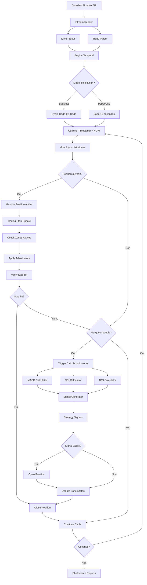

# Workflow 6: Exécution Stratégie Complète End-to-End

**Version:** 1.0  
**Statut:** Workflow intégré complet  
**Modules:** Engine Temporel + Indicateurs + Intégration  

## Vue d'ensemble

Ce workflow décrit l'exécution complète de la stratégie MACD/CCI/DMI de bout en bout, depuis l'ingestion des données jusqu'à la fermeture des positions, incluant tous les cas d'usage et modes d'exécution.

## Workflow principal intégré

### Diagramme complet end-to-end


## Workflow 1: Initialisation complète système

### Démarrage intégré
```yaml
SystemInitialization:
  Phase1_DataSources:
    steps:
      1. LoadConfiguration:
          - Charger config.yaml complet
          - Valider paramètres indicateurs
          - Initialiser seuils CCI par type signal
          
      2. InitializeDataSources:
          - Cache Binance configuré
          - Lecteurs ZIP streaming prêts
          - Parsers klines/trades initialisés
          
      3. ValidateHistoricalData:
          - Vérifier données période configurée
          - Contrôler continuité temporelle
          - Indexer marqueurs bougies
          
  Phase2_EngineComponents:
    steps:
      1. TemporalEngine:
          - Mode exécution sélectionné
          - Current_Timestamp initialisé
          - Anti-look-ahead activé
          
      2. PositionManager:
          - État position vide
          - Trailing stops configurés
          - Grille ajustements chargée
          
      3. ZoneMonitor:
          - Toutes zones inactives
          - Seuils événements configurés
          - Monitoring handlers prêts
          
  Phase3_IndicatorCalculators:
    steps:
      1. MACDCalculator:
          - Paramètres (12,26,9) configurés
          - Buffers EMA préparés
          - Précision validation active
          
      2. CCICalculator:
          - Période 14 configurée
          - Seuils multi-types chargés
          - Zone detection prête
          
      3. DMICalculator:
          - Période 14, seuil ADX 25
          - Algorithme Wilder's préparé
          - Trend analysis configurée
          
  Phase4_Integration:
    steps:
      1. Communication:
          - Interfaces Request/Response
          - Cache intelligent activé
          - Error recovery configuré
          
      2. Performance:
          - Métriques monitoring activées
          - Parallel processing configuré
          - Memory limits appliquées
          
  InitializationComplete:
    validation:
      - Tous composants status OK
      - Tests connectivity réussis
      - Memory usage baseline < 100MB
      - Ready for trading cycles
```

## Workflow 2: Cycle backtest complet

### Exécution trade-par-trade
```yaml
BacktestCycle:
  Initialization:
    - Load historical data SOLUSDT 2023-06-01 to 2023-06-30
    - Create chronological trade iterator  
    - Set initial Current_Timestamp = first_trade.timestamp
    - Initialize empty position state
    
  MainLoop:
    while trade_iterator.HasNext():
        
        # 1. Temporal Management
        current_trade = trade_iterator.Next()
        Current_Timestamp = current_trade.timestamp
        
        # 2. Update Historical Data (anti-look-ahead enforced)
        historical_candles.AppendUntil(Current_Timestamp)
        historical_trades.AppendUntil(Current_Timestamp)
        
        # 3. Position Management (if position open)
        if position.IsOpen:
            ProcessOpenPosition:
                # 3a. Basic trailing stop update
                current_price = current_trade.price
                profit_percent = (current_price - position.EntryPrice) / position.EntryPrice * 100
                
                base_stop = CalculateTrailingStop(current_price, position.Direction, config.trailing_stop_percent)
                if IsStopTighter(base_stop, position.StopLoss):
                    position.StopLoss = base_stop
                    
                # 3b. Check active zones
                for zone_type, zone in active_zones:
                    if zone.Active:
                        CheckZoneConditions:
                            case CCI_INVERSE:
                                # Continuous monitoring while in zone
                                if StillInCCIInverseZone() and ShouldApplyGrid(profit_percent):
                                    new_stop = ApplyAdjustmentGrid(profit_percent)
                                    position.StopLoss = min(position.StopLoss, new_stop)
                                    LogAdjustment("CCI zone adjustment applied")
                                    
                            case MACD_INVERSE, DI_COUNTER:
                                # One-time events
                                if ShouldApplyGrid(profit_percent):
                                    new_stop = ApplyAdjustmentGrid(profit_percent)  
                                    position.StopLoss = min(position.StopLoss, new_stop)
                                    zone.Active = false  # Deactivate after use
                                    
                # 3c. Check stop hit
                if IsStopHit(current_price, position.StopLoss, position.Direction):
                    ClosePosition(current_trade.timestamp, position.StopLoss, "stop_hit")
                    ResetActiveZones()
                    LogPositionClosure()
                    
        # 4. Indicator Calculations (only at candle markers)
        if IsMarkerTimestamp(Current_Timestamp):  # 00:00:00 detection
            
            # 4a. Prepare calculation request
            calculation_request = CalculationRequest{
                Symbol: "SOLUSDT"
                Timeframe: "5m"  # Current timeframe in loop
                CurrentTime: Current_Timestamp
                CandleWindow: GetLast300Candles()
                PositionContext: {
                    IsOpen: position.IsOpen
                    Direction: position.Direction
                    EntryCCIZone: position.EntryCCIZone
                    ProfitPercent: CalculateCurrentProfit()
                }
            }
            
            # 4b. Calculate indicators
            calculation_response = indicators.ProcessCalculationRequest(calculation_request)
            
            if calculation_response.Success:
                # 4c. Process signals (only if position closed)
                if not position.IsOpen:
                    for signal in calculation_response.Signals:
                        if signal.Type in [LONG_ENTRY, SHORT_ENTRY]:
                            OpenPosition:
                                position.IsOpen = true
                                position.Direction = signal.Type
                                position.EntryPrice = current_trade.price
                                position.EntryTime = Current_Timestamp
                                position.EntryCCIZone = calculation_response.Results.CCI.Zone
                                position.StopLoss = CalculateInitialStop(signal.Type, current_trade.price)
                                
                                LogPositionOpening(signal)
                                break  # Only one position at a time
                                
                # 4d. Process zone events
                for zone_event in calculation_response.ZoneEvents:
                    ProcessZoneEvent:
                        case CCI_ZONE_ENTERED:
                            if zone_event.IsInverse:
                                active_zones["CCI_INVERSE"].Active = true
                                active_zones["CCI_INVERSE"].EntryTime = Current_Timestamp
                                LogZoneActivation("CCI inverse zone entered")
                                
                        case CCI_ZONE_EXITED:
                            active_zones["CCI_INVERSE"].Active = false
                            LogZoneDeactivation("CCI inverse zone exited")
                            
                        case MACD_INVERSE_CROSS:
                            if position.CalculateProfitPercent() >= zone_event.ProfitThreshold:
                                active_zones["MACD_INVERSE"].Active = true
                                active_zones["MACD_INVERSE"].TriggerTime = Current_Timestamp
                                LogZoneActivation("MACD inverse event triggered")
                                
                        case DI_COUNTER_CROSS:
                            if position.CalculateProfitPercent() >= zone_event.ProfitThreshold:
                                active_zones["DI_COUNTER"].Active = true
                                active_zones["DI_COUNTER"].TriggerTime = Current_Timestamp
                                LogZoneActivation("DI counter event triggered")
            else:
                # 4e. Handle calculation errors
                HandleCalculationError(calculation_response.Error)
                
        # 5. Continue to next trade
        UpdateMetrics()
        if ShouldStop():  # Emergency conditions
            break
            
  Finalization:
    - Close any remaining open positions
    - Generate comprehensive backtest report  
    - Export trade logs and metrics
    - Performance analysis and validation
```

## Workflow 3: Cycle live/paper trading

### Exécution temps réel
```yaml
LiveTradingCycle:
  Initialization:
    - Connect to data sources (Binance API or paper feed)
    - Load recent historical context (last 300+ candles)
    - Sync system time with market time
    - Initialize position state from persistence
    
  MainLoop:
    while system_running:
        
        # 1. 10-second loop timing
        loop_start_time = time.Now()
        Current_Timestamp = loop_start_time.UnixMilli()
        
        # 2. Fetch new data since last loop
        new_data = dataSource.GetDataSince(last_processed_time)
        
        # Update historical buffers
        for trade in new_data.Trades:
            if trade.timestamp <= Current_Timestamp:
                historical_trades.Append(trade)
                
        for candle in new_data.Candles:
            if candle.close_time <= Current_Timestamp:
                historical_candles.Update(candle)
                
        # 3. Position management (if open)
        if position.IsOpen:
            current_price = GetCurrentPrice()  # Last trade price or bid/ask
            
            # Same position management logic as backtest
            ProcessOpenPosition(current_price)
            
        # 4. Check for new candle completion
        new_candles_completed = DetectNewCandles(last_processed_time, Current_Timestamp)
        
        for timeframe, candle_time in new_candles_completed:
            # Trigger indicator calculations for this timeframe
            calculation_request = PrepareCalculationRequest(timeframe, candle_time)
            calculation_response = indicators.ProcessCalculationRequest(calculation_request)
            
            # Process results same as backtest
            ProcessSignalsAndZoneEvents(calculation_response)
            
        # 5. Update timing and continue
        last_processed_time = Current_Timestamp
        
        # Wait for next loop (10 seconds total)
        elapsed = time.Since(loop_start_time)
        if elapsed < 10*time.Second:
            time.Sleep(10*time.Second - elapsed)
            
  ErrorHandling:
    - Network disconnection → automatic reconnection
    - Data feed interruption → fallback to cached data  
    - Calculation timeout → use previous values
    - Critical errors → safe position closure
```

## Workflow 4: Scénarios de test end-to-end

### Scénario 1: Signal LONG complet
```yaml
TestScenario_LongComplete:
  Setup:
    - Données SOLUSDT 2023-06-01 10:00:00 à 10:30:00  
    - Position fermée au départ
    - Configuration tendance DMI activée
    
  ExecutionSteps:
    T1_10:00:00 (Marqueur bougie):
      - MACD: croise à la hausse (previous: -0.5 vs -0.3, current: 0.2 vs 0.1)
      - CCI: -110 (oversold tendance, seuil -100)
      - DMI: DI+ = 30, DI- = 20 (bullish trend)
      → Signal LONG généré, confidence = 85%
      → Position ouverte: entry_price = 25.50, stop = 24.99 (2%)
      
    T2_10:05:00:
      - Prix = 25.80 (+1.2% profit)  
      - Trailing stop mis à jour: 25.28 (2% de 25.80)
      - Aucune zone active
      
    T3_10:10:00 (Marqueur bougie):
      - CCI passe à +120 (overbought, zone inverse!)
      → ZoneEvent CCI_ZONE_ENTERED détecté
      → Zone CCI_INVERSE activée
      
    T4_10:12:30:
      - Prix = 26.20 (+2.7% profit)
      - Zone CCI active + profit 2.7% → grille: 0-5% = stop 2%
      - Trailing stop reste 2% (pas d'ajustement encore)
      
    T5_10:15:00 (Marqueur bougie):
      - CCI toujours +130 (reste en zone)
      - Prix = 26.80 (+5.1% profit)
      - Profit > 5% → grille: 5-10% = stop 1.5%
      → Ajustement stop: 26.40 (1.5% de 26.80)
      
    T6_10:20:00:
      - Prix redescend à 26.30
      - Stop 26.40 pas touché
      - Zone CCI toujours active
      
    T7_10:22:00:
      - Prix = 26.35, proche du stop 26.40
      
    T8_10:23:15:  
      - Prix = 26.39 → Stop hit!
      → Position fermée: exit_price = 26.40, profit = +3.5%
      → Zones réinitialisées
      
  Validation:
    - Signal correctement détecté selon règles stratégie
    - Position ouverte aux bons paramètres
    - Zone CCI inverse activée et surveillée
    - Ajustement stop appliqué selon grille
    - Fermeture automatique au stop
    - Logs complets et cohérents
```

### Scénario 2: Gestion erreurs et recovery
```yaml
TestScenario_ErrorRecovery:
  Setup:
    - Position LONG ouverte avec profit +8%
    - Zone CCI_INVERSE active
    - Simulation pannes diverses
    
  ErrorScenarios:
    E1_CalculationTimeout:
      - Calculs indicateurs timeout après 5 secondes
      → Engine utilise cache derniers résultats
      → Position continue avec stops précédents
      → Retry calcul au marqueur suivant
      
    E2_DataGap:
      - Manque 2 minutes de données trades
      → Interpolation prix pour trailing stop
      → Warning logs mais cycle continue
      → Recovery à réception nouvelles données
      
    E3_MemoryOverflow:
      - Historiques dépassent limite 500MB
      → Nettoyage automatique anciennes données
      → Garde minimum requis pour calculs (300 candles)
      → Performance monitoring alerte
      
    E4_NetworkDisconnection:
      - Perte connexion données 30 secondes
      → Mode dégradé avec dernières données
      → Positions fermées en sécurité si critique
      → Reconnexion automatique avec resync
      
  Recovery_Validation:
    - Aucune corruption état position
    - Continuité logique malgré erreurs
    - Performance restaurée après recovery
    - Logs détaillés pour investigation
```

## Workflow 5: Performance et monitoring

### Métriques temps réel
```yaml
PerformanceMonitoring:
  LatencyMetrics:
    cycle_total_latency:
      target: < 200ms (backtest), < 500ms (live)
      measurement: timestamp_start to cycle_completion
      
    calculation_latency:
      target: < 50ms indicator calculations
      breakdown: MACD(15ms) + CCI(10ms) + DMI(15ms) + signals(10ms)
      
    position_management_latency:
      target: < 20ms per trade processing
      includes: stop_updates + zone_checks + adjustments
      
  ThroughputMetrics:
    trades_per_second:
      backtest: > 1000 trades/sec sustained
      live: real-time processing guaranteed
      
    parallel_symbols:
      target: 3 symboles simultanés sans dégradation
      resource_scaling: linear memory, parallel processing
      
  AccuracyMetrics:
    signal_precision:
      measurement: vs manual strategy verification
      target: 100% conformity to rules
      
    calculation_precision:
      measurement: vs TradingView/MetaTrader references  
      target: < 0.001% error on all indicators
      
    temporal_precision:
      measurement: anti-look-ahead violations
      target: 0 violations detected
      
  ResourceMetrics:
    memory_usage:
      baseline: < 100MB initialization
      operational: < 500MB sustained with 3 symbols
      peak: < 800MB during intensive calculations
      
    cpu_usage:
      average: < 25% single core
      peak: < 80% during parallel calculations
      efficiency: > 1000 calculations/second/core
      
  AlertingThresholds:
    critical:
      - cycle_latency > 1000ms: "Performance critically degraded"
      - memory_usage > 1000MB: "Memory leak suspected"
      - lookahead_violations > 0: "Temporal integrity compromised"
      
    warning:  
      - cycle_latency > 300ms: "Performance degraded"
      - cpu_usage > 50%: "High CPU utilization"
      - calculation_errors > 5%: "Calculation reliability issues"
```

### Optimisation continue
```yaml
PerformanceOptimization:
  CacheStrategies:
    indicator_cache:
      - Cache calculs si mêmes données input
      - TTL 1000ms pour éviter stale data
      - Hit ratio target > 60% conditions normales
      
    historical_data_cache:
      - Buffer intelligent dernières 500 candles
      - Éviction LRU anciennes données  
      - Compression données archivées
      
  ParallelProcessing:
    multi_symbol:
      - Goroutines séparées par symbole
      - Synchronisation résultats via channels
      - Load balancing dynamique
      
    multi_timeframe:
      - Calculs parallèles 5m/15m/1h/4h
      - Shared data structures pour efficiency
      - Timeout global avec fallbacks
      
  MemoryOptimization:
    data_structures:
      - Pre-allocated arrays éviter GC pressure
      - Pool buffers réutilisables
      - Streaming processing pour gros volumes
      
    garbage_collection:
      - Tuning GC parameters pour latence
      - Memory profiling régulier
      - Leak detection automatique
```

## Configuration complète système

```yaml
system:
  execution:
    mode: "backtest"  # backtest | paper | live
    symbols: ["SOLUSDT", "SUIUSDT", "ETHUSDT"]
    timeframes: ["5m", "15m", "1h", "4h"]
    
  data_period:
    start_date: "2023-06-01"
    end_date: "2023-06-30"
    
  # Engine Temporel Configuration
  engine:
    window_size: 300
    anti_lookahead: true
    
    position:
      max_positions: 1
      trailing_stop:
        trend_percent: 2.0
        counter_trend_percent: 1.5
      adjustment_grid:
        - profit_range: [0, 5]
          trailing_percent: 2.0
        - profit_range: [5, 10]  
          trailing_percent: 1.5
        - profit_range: [10, 20]
          trailing_percent: 1.0
        - profit_range: [20, 100]
          trailing_percent: 0.5
          
    zones:
      cci_inverse:
        enabled: true
        monitoring: "continuous"
      macd_inverse:
        enabled: true  
        profit_threshold: 0.5
      di_counter:
        enabled: true
        profit_threshold: 1.0
        
  # Indicateurs Configuration  
  indicators:
    macd:
      fast_period: 12
      slow_period: 26
      signal_period: 9
      
    cci:
      period: 14
      long_trend_oversold: -100
      long_trend_overbought: 100
      long_counter_trend_oversold: -150
      long_counter_trend_overbought: 150
      short_trend_oversold: -120
      short_trend_overbought: 120
      short_counter_trend_oversold: -180
      short_counter_trend_overbought: 180
      
    dmi:
      period: 14
      adx_period: 14
      trend_threshold: 25
      
  signal_generation:
    filters:
      macd_same_sign_filter: false
      dmi_trend_signals_enabled: true
      dmi_counter_trend_signals_enabled: false
      dx_adx_filter_enabled: false
      
  # Intégration Configuration
  integration:
    request_timeout: 5000ms
    cache_enabled: true
    cache_ttl: 1000ms
    parallel_symbols: true
    
  # Performance Configuration
  performance:
    max_cycle_latency_ms: 200
    max_memory_mb: 500
    metrics_enabled: true
    profiling_enabled: false
```

---

*Version 1.0 - Stratégie End-to-End : Exécution complète intégrée avec performance et robustesse*
